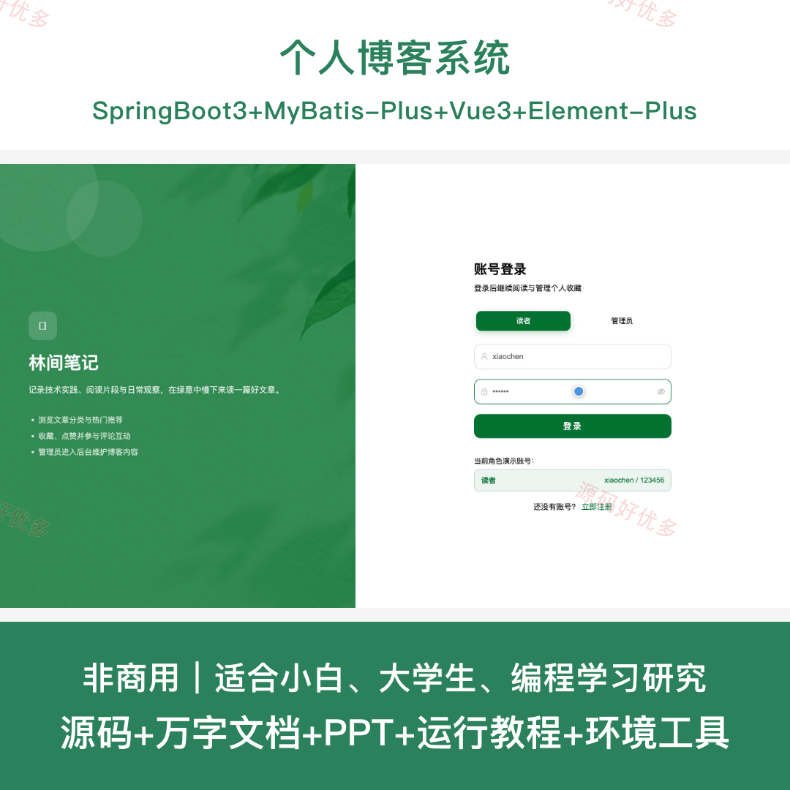
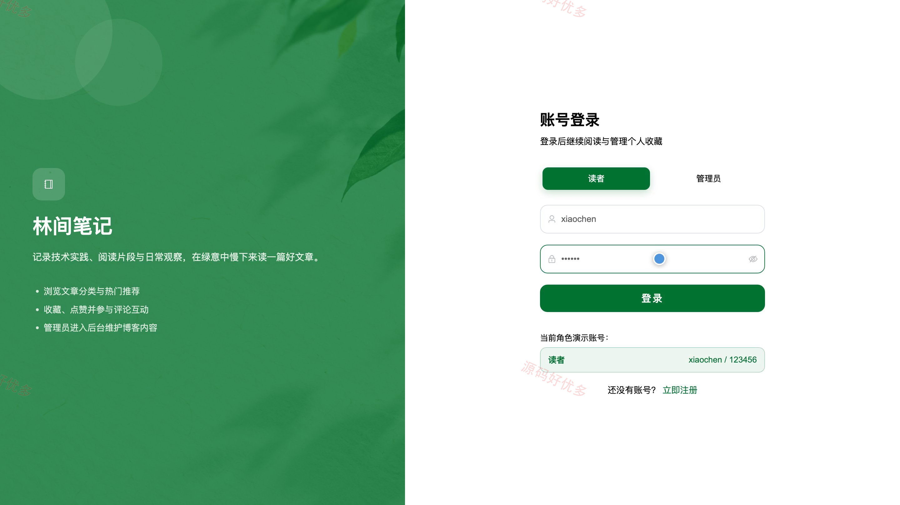
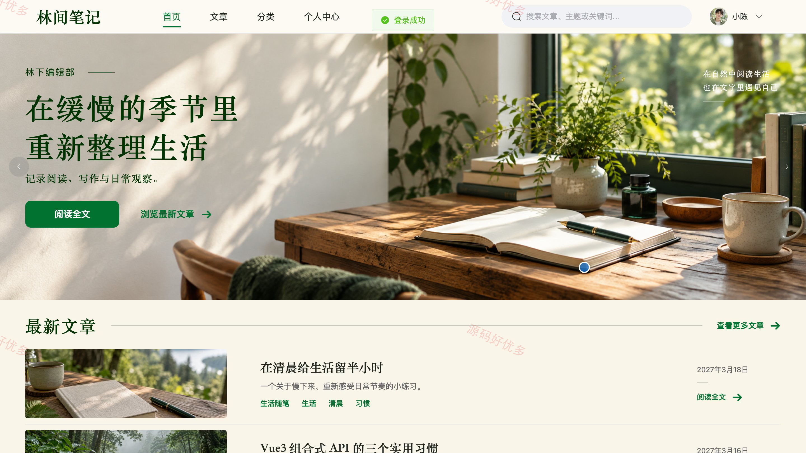
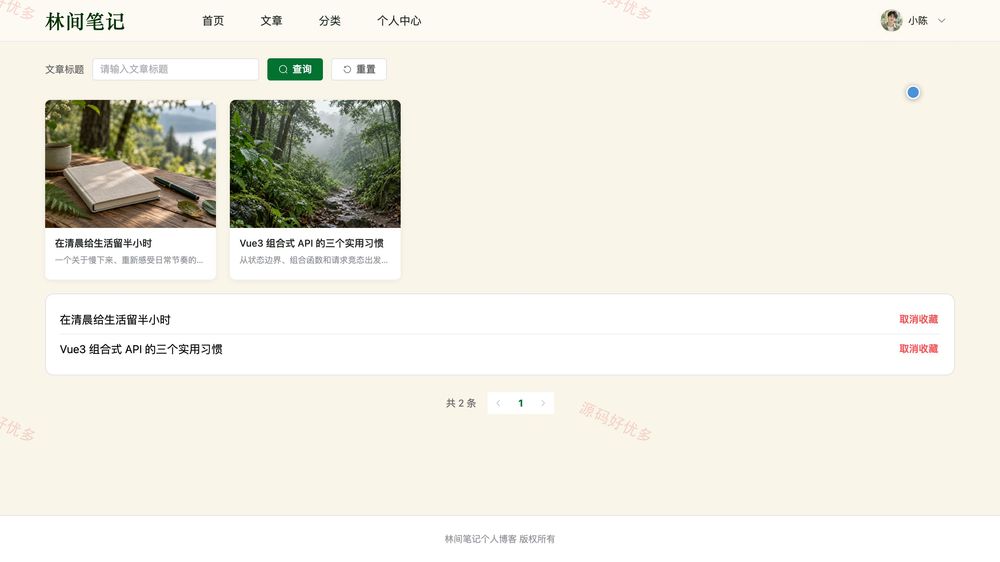
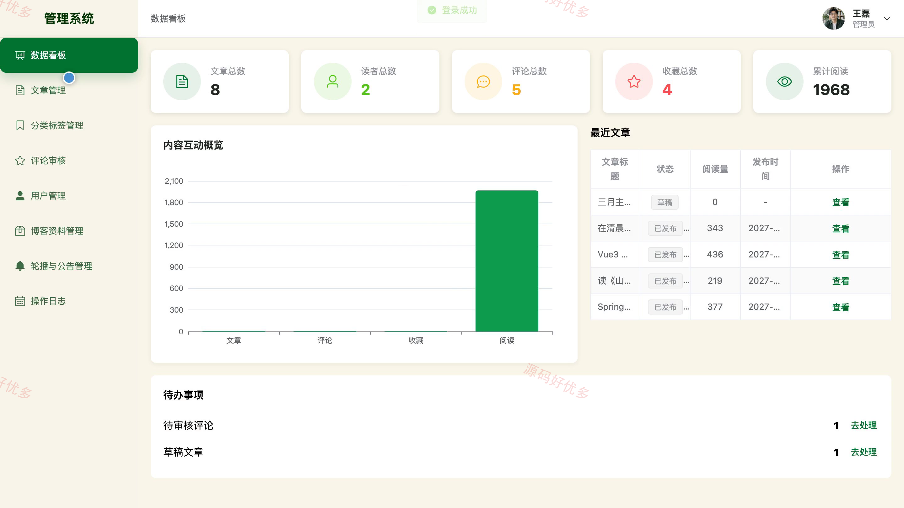
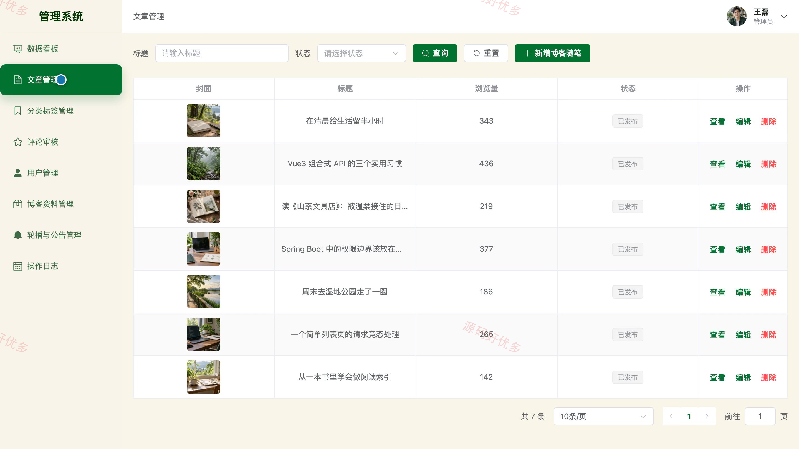
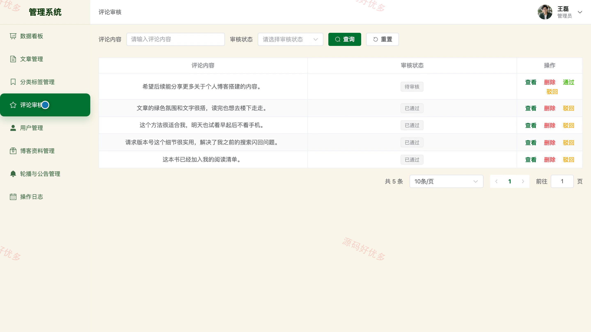
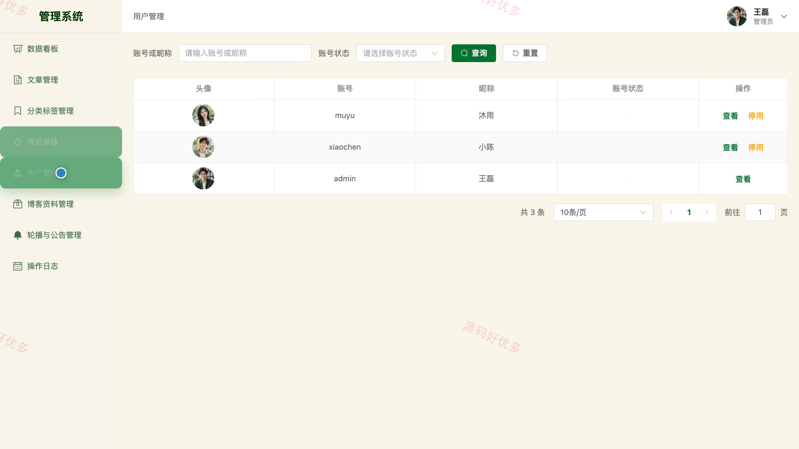

# bs118A
bs118A个人博客系统
## 源码问题查看主页咨询

### 一、关键词
个人博客、博客文章发布、内容创作平台、随笔分享、读者互动

### 二、作品包含
源码+数据库+万字设计文档+PPT+全套环境和工具资源+本地部署教程

### 三、项目技术
前端技术： Html、Css、Js、Vue3.4、Element-Plus
后端技术：Java、SpringBoot3.2.0、MyBatis-Plus

### 四、运行环境要求
开发工具：IDEA/eclipse + VSCODE

数据库：MySQL5.7+（共11张表）

数据库管理工具：Navicat10以上版本

环境配置软件： JDK17 + Maven3.6

前端Nodejs：16+

浏览器：谷歌浏览器

### 五、项目介绍
项目编号：bs118A

本系统面向个人博客内容发布与读者互动场景，读者可浏览、搜索和分类筛选文章，完成点赞、收藏、评论及个人资料维护；管理员通过数据看板掌握内容与互动情况，并管理文章发布状态、分类标签、评论审核、读者账号、博客资料、轮播公告和操作日志。

角色：读者、管理员

读者功能：注册登录与密码修改、首页推荐及热门文章浏览、文章搜索与分类标签筛选、文章详情阅读与阅读量查看、文章点赞收藏及取消、评论发布与审核结果查看、个人资料维护、收藏点赞评论记录。

管理员功能：管理员登录与数据看板、文章草稿发布下架管理、分类标签管理、评论审核管理、读者账号及启停管理、博客资料管理、轮播公告管理、操作日志查看。

### 六、运行截图

